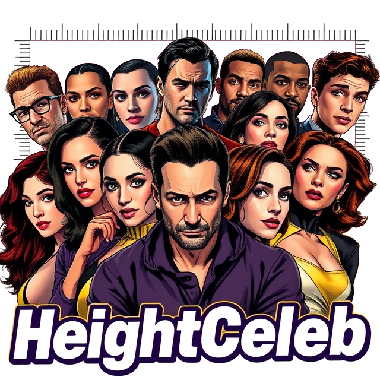

  

# HeightCeleb
This repository contains the dataset described in article *["HeightCeleb - an enrichment of VoxCeleb dataset with speaker height information"](https://arxiv.org/abs/2410.12668)*,
which will be presented at [SLT 2024](https://2024.ieeeslt.org/) conference in Macau, China.

The dataset is an extension to [Voxceleb](https://www.robots.ox.ac.uk/~vgg/data/voxceleb/vox1.html) dataset and contains
height information that was scraped from the Internet.

## Live demo of system trained with HeightCeleb
[Demo system](https://huggingface.co/spaces/stachu86/HeightCeleb-estimator-demo) deployed in HuggingFace Spaces

## Dataset Attribution

HeightCeleb dataset is an extension of [Voxceleb](https://www.robots.ox.ac.uk/~vgg/data/voxceleb/vox1.html) dataset. 

A. Nagrani, J. S. Chung, A. Zisserman,
*"VoxCeleb: a large-scale speaker identification dataset"*, INTERSPEECH, 2017
- **Original dataset**: [https://www.robots.ox.ac.uk/~vgg/data/voxceleb/](https://www.robots.ox.ac.uk/~vgg/data/voxceleb/)
- **License**: [https://www.robots.ox.ac.uk/~vgg/data/voxmovies/files/license.txt](https://www.robots.ox.ac.uk/~vgg/data/voxmovies/files/license.txt)

### Modifications
This dataset contains `VoxCeleb1 ID`, `sex`
and `split` information from the Voxceleb dataset.

## Licenese
HighCeleb dataset is distributed under [CC BY 4.0](https://creativecommons.org/licenses/by/4.0/) license.

